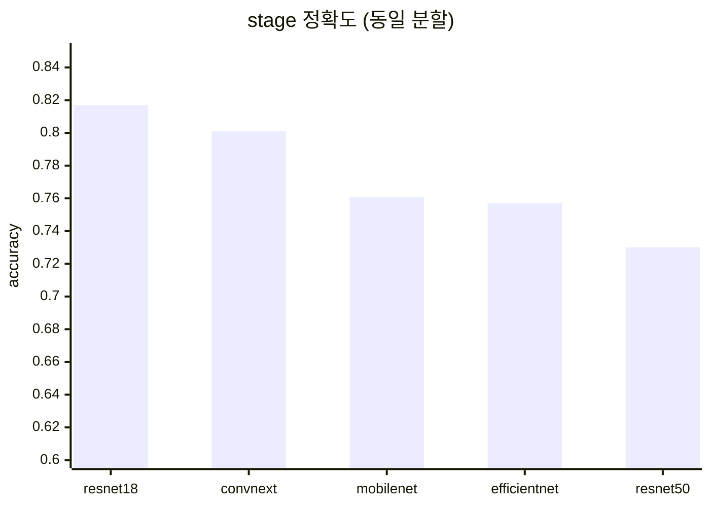

# LeafScan Lab — 모델별 최적 조합 · 종합 비교 보고 (study_02_lr)

> 백본 5종 × 모델별 학습률 자동 탐색 · 동일 분할 공정 비교
> 2026-08-19 · GTX 1650 4GB · train 23,377장 / val 4,592장 · wandb 그룹 `study_02_lr`

---

## 1. 실험 방법 — 공정 비교 프로토콜

| 단계 | 내용 |
|---|---|
| ① 분할 고정 | study 시작 시 train/val/test 분할(`split.json`)을 한 번 만들어 5개 모델 전부가 공유 — 그룹 누수 없음 |
| ② LR 자동 탐색 | 모델마다 학습률 후보 3점을 예산 30%(6 epoch)로 짧게 학습해 val_loss 최저인 학습률을 선정 |
| ③ 본 학습 | 선정된 최적 LR로 최대 20 epoch — early stop 5회(미개선 시 자동 중단) |
| ④ 공통 조건 | 해상도 224 · pretrained · freeze 3 epoch · AdamW · class weight auto · head 가중치 crop 0.4 / stage 0.6 · seed 42 |

**지표 읽는 법** — crop 정확도는 전 모델 1.000(만점)이라 비교 지표는 **stage(생육단계) macro-F1** — 소수 클래스(수확기 7.5%)를 공평하게 반영하는 지표.

## 2. 종합 비교 — resnet18이 성능·속도 모두 1위

| 순위 | 모델 | 최적 LR | stage macro-F1 | stage 정확도 | 정식기 recall | 학습 시간 |
|:---:|---|:---:|:---:|:---:|:---:|:---:|
| 🥇 1 | **resnet18** | **3.0e-03** | **0.745** | **0.817** | **0.741** | **14분** |
| 2 | convnext_tiny | 1.0e-03 | 0.717 | 0.801 | 0.663 | 3.1시간 |
| 3 | mobilenet_v3_small | 1.0e-03 | 0.688 | 0.761 | 0.731 | 9분 |
| 4 | efficientnet_b0 | 1.0e-03 | 0.678 | 0.757 | 0.684 | 21분 |
| 5 | resnet50 | 3.0e-04 | 0.662 | 0.730 | 0.720 | 50분 |

| 핵심 수치 | 값 |
|---|---|
| crop 정확도 (전 모델 공통) | **1.000** |
| LR 탐색으로 얻은 resnet18 macro-F1 상승 | **+0.09** (0.653 → 0.745) |
| convnext 대비 resnet18 속도 우위 | **13배** |

## 3. 핵심 발견 4가지

1. **모델마다 최적 학습률이 다르다** — resnet18은 기본의 3배(0.003), resnet50은 3분의 1(0.0003)이 최적. 한 가지 LR로 비교하면 순위가 왜곡된다 (study_01의 resnet18 0.653 → study_02에서 0.745로 뛴 이유).
2. **작은 모델이 이긴다** — 23,000장 규모에서 resnet50·convnext 같은 큰 모델은 epoch 2~3 만에 과적합으로 꺾인다. 11.2M 파라미터의 resnet18이 최적점.
3. **분할이 바뀌면 순위도 바뀐다** — study_01 1위였던 efficientnet_b0가 이번 분할에서는 4위. 같은 분할 안에서만 공정 비교가 성립한다.
4. **남은 병목은 stage 하나** — crop(작물 구분)은 어떤 모델이든 만점. 생육단계, 특히 소수 클래스인 수확기(7.5%)가 성능을 가른다.

## 4. 모델별 최적 조합 (GUI 설정 가이드)

각 모델의 표는 콘솔 좌측 사이드바에서 **조작하는 모든 버튼·슬라이더**를 위에서 아래 순서대로 적었다.
★ 표시가 기본값에서 실제로 바꿔야 하는 항목이다.

### 🥇 1위 · resnet18

| UI 항목 (사이드바 위치) | 설정값 | 비고 |
|---|---|---|
| 실행 모드 (최상단) | 단일 실행 | 비교 재현이면 Study 실행 |
| ② arch | **resnet18** | 드롭다운에서 선택 ★ |
| ② 입력 해상도 | 224 | 기본값 유지 |
| ② pretrained (ImageNet 가중치) | ✔ 체크 | 기본값 유지 |
| ② freeze epoch | 3 epoch 백본 동결 | 슬라이더 · 기본값 유지 |
| ③ Epoch | 20 | 슬라이더 · 기본값 유지 |
| ③ 배치 | **16** | 32 까지 안전 (더 빠름) |
| ③ Learning rate | **3.0e-03** (슬라이더 **-2.5**) | 로그 슬라이더 ★ |
| ③ Optimizer | AdamW | 기본값 유지 |
| ③ class weight | auto | stage 불균형 보정 — 유지 |
| ③ head 가중치 | crop 0.4 · stage 0.6 | 스핀박스 · 기본값 유지 |
| 고급 › Early stop | 5회 미개선 중단 | 기본값 유지 · 실측 best 2 → epoch 7에서 종료 |
| 고급 › seed | 42 | 기본값 유지 (재현성) |
| 고급 › AMP 혼합정밀 | 무관 | GTX 16xx 는 워커가 자동 해제 |
| 고급 › wandb 실험 추적 | ✔ 체크 | 기록·비교용 (기본 켜짐) |

| LR 탐색 (val_loss) | 1e-3 → 0.3813 | **3e-3 → 0.3521 ✔** | 1e-2 → 0.5157 |
|---|---|---|---|

* 결과: macro-F1 **0.745** · stage 정확도 0.817 · 정식기 recall 0.741 · **14분** (best epoch 2, 7에서 종료)
* 평가: 기본 LR의 3배가 최적 — LR 탐색의 최대 수혜자. **성능·속도 모두 1위**

### 2위 · convnext_tiny

| UI 항목 (사이드바 위치) | 설정값 | 비고 |
|---|---|---|
| 실행 모드 (최상단) | 단일 실행 | 비교 재현이면 Study 실행 |
| ② arch | **convnext_tiny** | 드롭다운에서 선택 ★ |
| ② 입력 해상도 | 224 | 기본값 유지 |
| ② pretrained (ImageNet 가중치) | ✔ 체크 | 기본값 유지 |
| ② freeze epoch | 3 epoch 백본 동결 | 슬라이더 · 기본값 유지 |
| ③ Epoch | 20 | 슬라이더 · 기본값 유지 |
| ③ 배치 | **16** | 4GB 에서 16 고정 |
| ③ Learning rate | **1.0e-03** (슬라이더 **-3.0 · 기본**) | 로그 슬라이더 |
| ③ Optimizer | AdamW | 기본값 유지 |
| ③ class weight | auto | stage 불균형 보정 — 유지 |
| ③ head 가중치 | crop 0.4 · stage 0.6 | 스핀박스 · 기본값 유지 |
| 고급 › Early stop | 5회 미개선 중단 | 기본값 유지 · 실측 best 3 → epoch 8에서 종료 |
| 고급 › seed | 42 | 기본값 유지 (재현성) |
| 고급 › AMP 혼합정밀 | 무관 | GTX 16xx 는 워커가 자동 해제 |
| 고급 › wandb 실험 추적 | ✔ 체크 | 기록·비교용 (기본 켜짐) |

| LR 탐색 (val_loss) | 1e-4 → 0.3667 | 3e-4 → 0.3231 | **1e-3 → 0.2993 ✔** |
|---|---|---|---|

* 결과: macro-F1 **0.717 (2위)** · stage 정확도 0.801 · 정식기 recall 0.663 · best val_loss **0.299 (전체 1위)** · **3.1시간** (best epoch 3, 8에서 종료)
* 평가: macro-F1 2위·val_loss 1위지만 정식기 recall 은 최하위, 시간이 13배 — 실용성 낮음

### 3위 · mobilenet_v3_small

| UI 항목 (사이드바 위치) | 설정값 | 비고 |
|---|---|---|
| 실행 모드 (최상단) | 단일 실행 | 비교 재현이면 Study 실행 |
| ② arch | **mobilenet_v3_small** | 드롭다운에서 선택 ★ |
| ② 입력 해상도 | 224 | 기본값 유지 |
| ② pretrained (ImageNet 가중치) | ✔ 체크 | 기본값 유지 |
| ② freeze epoch | 3 epoch 백본 동결 | 슬라이더 · 기본값 유지 |
| ③ Epoch | 20 | 슬라이더 · 기본값 유지 |
| ③ 배치 | **16** | 초경량이라 64 까지 가능 |
| ③ Learning rate | **1.0e-03** (슬라이더 **-3.0 · 기본**) | 로그 슬라이더 |
| ③ Optimizer | AdamW | 기본값 유지 |
| ③ class weight | auto | stage 불균형 보정 — 유지 |
| ③ head 가중치 | crop 0.4 · stage 0.6 | 스핀박스 · 기본값 유지 |
| 고급 › Early stop | 5회 미개선 중단 | 기본값 유지 · 실측 best 3 → epoch 8에서 종료 |
| 고급 › seed | 42 | 기본값 유지 (재현성) |
| 고급 › AMP 혼합정밀 | 무관 | GTX 16xx 는 워커가 자동 해제 |
| 고급 › wandb 실험 추적 | ✔ 체크 | 기록·비교용 (기본 켜짐) |

| LR 탐색 (val_loss) | **1e-3 → 0.3400 ✔** | 3e-3 → 0.3463 | 1e-2 → 0.4148 |
|---|---|---|---|

* 결과: macro-F1 0.688 · stage 정확도 0.761 · 정식기 recall 0.731 · **9분 (최속)** (best 3, 8에서 종료)
* 평가: 초경량(0.9M) — 엣지 배포·속도 최우선이면 유력 후보

### 4위 · efficientnet_b0

| UI 항목 (사이드바 위치) | 설정값 | 비고 |
|---|---|---|
| 실행 모드 (최상단) | 단일 실행 | 비교 재현이면 Study 실행 |
| ② arch | **efficientnet_b0** | 드롭다운에서 선택 ★ |
| ② 입력 해상도 | 224 | 기본값 유지 |
| ② pretrained (ImageNet 가중치) | ✔ 체크 | 기본값 유지 |
| ② freeze epoch | 3 epoch 백본 동결 | 슬라이더 · 기본값 유지 |
| ③ Epoch | 20 | 슬라이더 · 기본값 유지 |
| ③ 배치 | **16** | 32 까지 안전 |
| ③ Learning rate | **1.0e-03** (슬라이더 **-3.0 · 기본**) | 로그 슬라이더 |
| ③ Optimizer | AdamW | 기본값 유지 |
| ③ class weight | auto | stage 불균형 보정 — 유지 |
| ③ head 가중치 | crop 0.4 · stage 0.6 | 스핀박스 · 기본값 유지 |
| 고급 › Early stop | 5회 미개선 중단 | 기본값 유지 · 실측 best 2 → epoch 7에서 종료 |
| 고급 › seed | 42 | 기본값 유지 (재현성) |
| 고급 › AMP 혼합정밀 | 무관 | GTX 16xx 는 워커가 자동 해제 |
| 고급 › wandb 실험 추적 | ✔ 체크 | 기록·비교용 (기본 켜짐) |

| LR 탐색 (val_loss) | 3e-4 → 0.3505 | **1e-3 → 0.3405 ✔** | 3e-3 → 0.3754 |
|---|---|---|---|

* 결과: macro-F1 0.678 · stage 정확도 0.757 · 정식기 recall 0.684 · 21분 (best 2, 7에서 종료)
* 평가: study_01에서는 1위였으나 이번 분할에서는 4위 — 분할 민감성의 사례

### 5위 · resnet50

| UI 항목 (사이드바 위치) | 설정값 | 비고 |
|---|---|---|
| 실행 모드 (최상단) | 단일 실행 | 비교 재현이면 Study 실행 |
| ② arch | **resnet50** | 드롭다운에서 선택 ★ |
| ② 입력 해상도 | 224 | 기본값 유지 |
| ② pretrained (ImageNet 가중치) | ✔ 체크 | 기본값 유지 |
| ② freeze epoch | 3 epoch 백본 동결 | 슬라이더 · 기본값 유지 |
| ③ Epoch | 20 | 슬라이더 · 기본값 유지 |
| ③ 배치 | **16** | 16 고정 (32 는 OOM 위험) |
| ③ Learning rate | **3.0e-04** (슬라이더 **-3.5**) | 로그 슬라이더 ★ |
| ③ Optimizer | AdamW | 기본값 유지 |
| ③ class weight | auto | stage 불균형 보정 — 유지 |
| ③ head 가중치 | crop 0.4 · stage 0.6 | 스핀박스 · 기본값 유지 |
| 고급 › Early stop | 5회 미개선 중단 | 기본값 유지 · 실측 best 3 → epoch 8에서 종료 |
| 고급 › seed | 42 | 기본값 유지 (재현성) |
| 고급 › AMP 혼합정밀 | 무관 | GTX 16xx 는 워커가 자동 해제 |
| 고급 › wandb 실험 추적 | ✔ 체크 | 기록·비교용 (기본 켜짐) |

| LR 탐색 (val_loss) | **3e-4 → 0.3188 ✔** | 1e-3 → 0.3200 | 3e-3 → 0.3483 |
|---|---|---|---|

* 결과: macro-F1 0.662 · stage 정확도 0.730 · 정식기 recall 0.720 · **50분** (best 3, 8에서 종료)
* 평가: 시간은 4배 이상 쓰면서 성능은 최하위 — 23k장 규모에는 과대 모델

## 5. 🏆 최종 추천

> ### resnet18 · Learning rate 3.0e-03
> 배치 16~32 · 나머지 설정은 전부 기본값 — **바꿀 것은 사실상 LR 슬라이더(-2.5) 하나**
>
> macro-F1 **0.745** (1위) · 학습 **14분** (반복 실험 최적) · crop 정확도 **1.000**

### 다음 단계 제안

- **study_03** — resnet18 고정, head 가중치 0.4/0.6 vs 0.2/0.8 비교 (stage가 유일한 병목이므로 가장 유망)
- **study_04** — freeze epoch 0 / 3 / 5 비교로 전이학습 스케줄 확정
- 결과는 wandb `leafscan-lab` 프로젝트의 study 그룹에서 실시간 비교 가능
